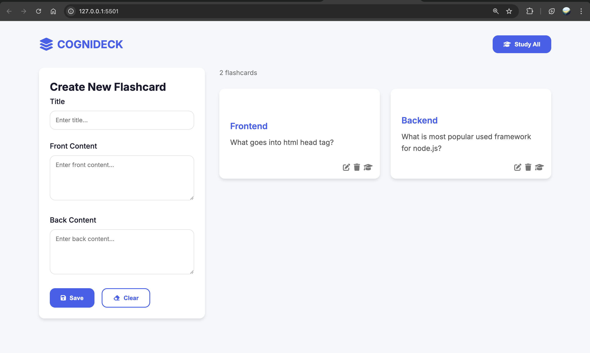

# CogniDeck

CogniDeck is a web-based flashcard application that helps users create, manage, and study flashcards for efficient learning and revision. The project is built using HTML, CSS, and JavaScript, and stores flashcards locally in the browser using localStorage.

## Features

- Create, edit, and delete flashcards
- Study mode with card flipping
- Responsive grid layout for flashcards
- Flashcard statistics display
- Toast notifications for user feedback
- Persistent storage using localStorage

## Getting Started

1. **Clone or Download** this repository.
2. Open `index.html` in your web browser.

No build steps or dependencies are required.

## Project Structure

- `index.html` — Main HTML file
- `styles.css` — Project styles (responsive, modern UI)
- `script.js` — All application logic (flashcard CRUD, study mode, UI updates)

## Usage

- Add new flashcards using the form
- Edit or delete existing flashcards
- Enter study mode to review cards and flip them for answers

## License

MIT License
